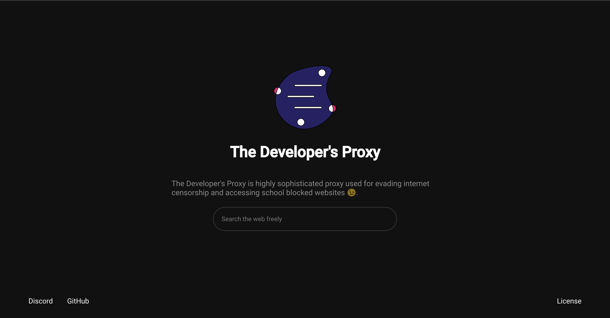

# An Ultraviolet Web Proxy


## Description
This website is used to bypass an organization's restrictions like goverment or something smaller like a school. After this your website will be at https://example.com/proxy

## Installation

#### - Follow the Quickstart to start a bare server on port 8080/3030/etc [here](https://github.com/tomphttp/specifications/blob/master/BareServer.md#considerations-when-running-an-implementation-under-nginx-apache2-or-lighttpd) 
Note: Make sure to read the Nginx specifications.

#### - Your webroot is /var/www/html/ or whatever that serves / on your website
#### - Download UV from [here](https://github.com/titaniumnetwork-dev/Ultraviolet/releases/tag/v1.0.5)  and extract the dist folder to a folder named ```uv``` in your static webroot
#### - Download ultraviolet-static from [here](https://github.com/titaniumnetwork-dev/Ultraviolet-Static) extract the dist dir to a folder named ```proxy``` in your static webroot
#### - Overwrite ```/var/www/html/uv/uv.config.js``` with ```/var/www/html/proxy/uv/uv.config.js```
#### - Modify ```/var/wwww/html/proxy/index.html```, make sure the links are correct
#### - Modify ```/var/www/html/uv/uv.config.js``` Make sure:
  - bare is set to /bare/
  - prefix is set to /uv/service/ 
